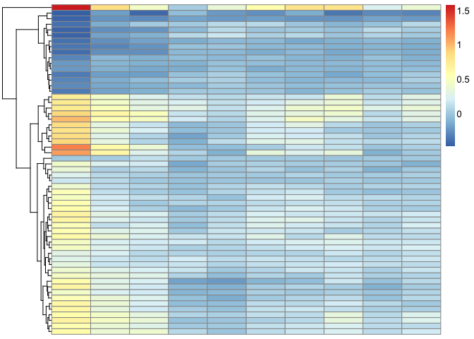

# Biostat 578 HW4


```r
#source("http://bioconductor.org/biocLite.R")
#biocLite("limma")

library(limma)
library(GEOquery)
```

```
## Loading required package: Biobase
## Loading required package: BiocGenerics
## Loading required package: parallel
## 
## Attaching package: 'BiocGenerics'
## 
## The following objects are masked from 'package:parallel':
## 
##     clusterApply, clusterApplyLB, clusterCall, clusterEvalQ,
##     clusterExport, clusterMap, parApply, parCapply, parLapply,
##     parLapplyLB, parRapply, parSapply, parSapplyLB
## 
## The following object is masked from 'package:limma':
## 
##     plotMA
## 
## The following object is masked from 'package:stats':
## 
##     xtabs
## 
## The following objects are masked from 'package:base':
## 
##     anyDuplicated, append, as.data.frame, as.vector, cbind,
##     colnames, do.call, duplicated, eval, evalq, Filter, Find, get,
##     intersect, is.unsorted, lapply, Map, mapply, match, mget,
##     order, paste, pmax, pmax.int, pmin, pmin.int, Position, rank,
##     rbind, Reduce, rep.int, rownames, sapply, setdiff, sort,
##     table, tapply, union, unique, unlist, unsplit
## 
## Welcome to Bioconductor
## 
##     Vignettes contain introductory material; view with
##     'browseVignettes()'. To cite Bioconductor, see
##     'citation("Biobase")', and for packages 'citation("pkgname")'.
## 
## Setting options('download.file.method.GEOquery'='auto')
```

```r
library(data.table)

data_dir = "~/Documents/Data/GEO/"
gd <- getGEO("GSE45735", destdir = data_dir)
```

```
## ftp://ftp.ncbi.nlm.nih.gov/geo/series/GSE45nnn/GSE45735/matrix/
## Found 1 file(s)
## GSE45735_series_matrix.txt.gz
## Using locally cached version: ~/Documents/Data/GEO//GSE45735_series_matrix.txt.gz
## Using locally cached version of GPL10999 found here:
## ~/Documents/Data/GEO//GPL10999.soft
```

```r
pd <- pData(gd[[1]])
## get the actual expression data for five individuals (not sure which five, but subjects 2-6 were discussed a lot in the paper)
getGEOSuppFiles("GSE45735", makeDirectory=FALSE, baseDir = data_dir)
```

```
## ftp://ftp.ncbi.nlm.nih.gov/geo/series/GSE45nnn/GSE45735/suppl/
```

```r
# Note the regular expression to grep file names
files <- list.files(path = data_dir, pattern = "GSE45735_T.*.gz", full.names = TRUE)

# Read in gzip-compressed, tab-delimited files
file_list_orig <- lapply(files, function(x) data.table(read.table(x, sep='\t', header=TRUE), key='Gene'))

# Subset to only those rows where Gene contains only
# non-space characters This addresses problems with T14 file
# containing 28 invalid rows at end of file
file_list <- lapply(file_list_orig, function(file_list) subset(file_list, 
    grepl("^[^[:space:]]+$", Gene)))

##  which files had the bad rows?
as.numeric(lapply(file_list_orig, nrow)) - as.numeric(lapply(file_list, nrow))
```

```
## [1]  0  0 29  0  0
```

```r
# Remove duplicated rows
x=file_list[[1]]
file_list_unique <- lapply(file_list, function(x) {
    x <- x[!duplicated(x$Gene), ]
    x <- x[order(x$Gene), ]
    # data.tables don't have rownames
    # rownames(x) <- x$Gene
    # this doesn't drop the first colunn in data.table, so I took it out
    # x[, -1]
})

##  again, which files had the duplicate rows?
as.numeric(lapply(file_list, nrow)) - as.numeric(lapply(file_list_unique, nrow))
```

```
## [1] 28 28 28 28 28
```

```r
## keep genes in all five files (the data.table way, which I think isn't as nice..)
## also, the second file is missing day 8 (why??) - if you want to rbind them, you have to do this:
# file_list_unique[[2]][, X8:=NA]
## add a file ID to each file
# lapply(1:5, function(x) file_list_unique[[x]][, cat := x])
## turn into a big data.table
# full_data_dt = do.call('rbind', file_list_unique)
## only keep genes with all five
# full_data_dt[, N := .N, by=Gene]
# full_data_dt = full_data_dt[N == 5]
# full_data_dt[cat==3]

## make sure that they all have the same set of genes
gene_names <- Reduce(intersect, lapply(file_list_unique, function(dt) dt[,Gene]))
file_list_unique <- lapply(file_list_unique, function(dt) dt[gene_names])
# alternatively: lapply(file_list_unique, '[', gene_names)
## then drop the gene column
file_list_unique <- lapply(file_list_unique, function(dt) dt[, Gene := NULL])

## now cbind them all, to get one matrix with one row per gene, and one column per observation (individual/day)
matrix = as.matrix(do.call(cbind, file_list_unique))

## set row names
rownames(matrix) <- gene_names

## clean up pData( remove info about day 8 for second dataset, etc )
pd_small <- pd[!grepl("T13_Day8", pd$title), ]
## split out day and subject (what a pain in the ass)
pd_small$Day <- sapply(strsplit(gsub(" \\[PBMC\\]", "", pd_small$title), "_"), "[", 2)
pd_small$subject <- sapply(strsplit(gsub(" \\[PBMC\\]", "", pd_small$title), "_"), "[", 1)

## set matrix column names
colnames(matrix) <- rownames(pd_small)


## set the rnaseq data as though it's expression data (right?)
new_set <- ExpressionSet(assayData = matrix + 1)
pData(new_set) <- pd_small

## experiment design
design <- model.matrix(~subject + Day, new_set)
## normalize with voom
new_set_voom <- voom(new_set, design = design)

### now actually run limma analysis
lm <- lmFit(new_set_voom, design)
eb <- eBayes(lm)

## messing around
# Look at the other time-points
# topTable(eb, coef = "DayDay3", adjust='fdr', number = Inf, p.value = .01, sort.by="p")
# day1 = topTable(eb, coef = "DayDay1", adjust='fdr', number = Inf, p.value = .01, sort.by="p")
# day1 = data.table(day1, Gene=rownames(day1), key = "Gene")
# day3 = topTable(eb, coef = "DayDay3", adjust='fdr', number = Inf)
# day3 = data.table(day3, Gene=rownames(day3), key = "Gene")
# with(day1[day3, nomatch=0], plot(logFC, i.logFC))

# get a list of all genes that are significant on any day (I am really not sure that this is correct - only one gene is significant on a day other than the first)
significant_genes = unique(unlist(sapply(1:10, function(x) rownames(topTable(eb, coef = sprintf("DayDay%d", x), adjust='fdr', sort.by='none', number=Inf, p.value=.01)))))

# now get the matrix of logFC for all those genes across all days
a = sapply(1:10, function(x) {
  dt = topTable(eb, coef = sprintf("DayDay%d", x), adjust='fdr', 
                sort.by='none', number=Inf)
  dt = data.table(dt, Gene=rownames(dt), key="Gene")
  dt[significant_genes]$logFC})

library("pheatmap")
library("RColorBrewer")

# now plot it
pheatmap(a, cluster_cols = F)
```

 

```r
# day2 = topTable(eb, coef = "DayDay2", adjust='fdr', number = Inf, sort.by="none")
# day3[day1_genes]
# 
# sapply(1:10, function(x) topTable(eb, coef = sprintf("DayDay%d", x), adjust='fdr')$logFC)
# sapply(1:10, function(x) topTable(eb, coef = sprintf("DayDay%d", x), adjust='fdr', sort.by='none', number=Inf)$logFC)
# ?topTable
# library(plyr)
#
```

